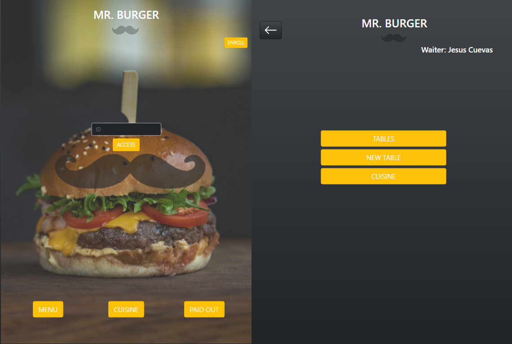
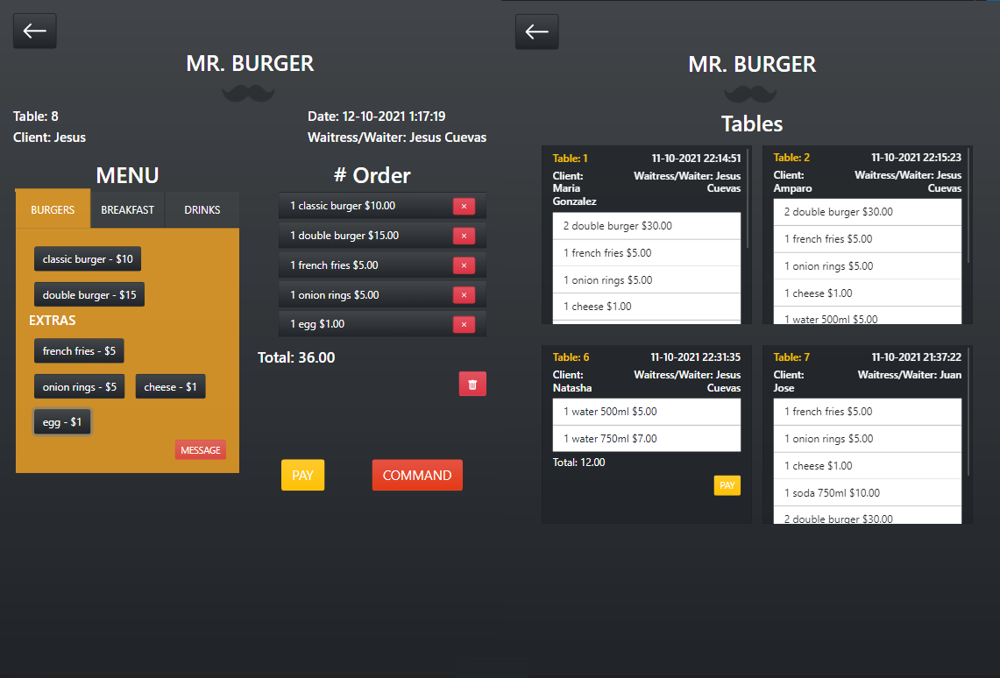
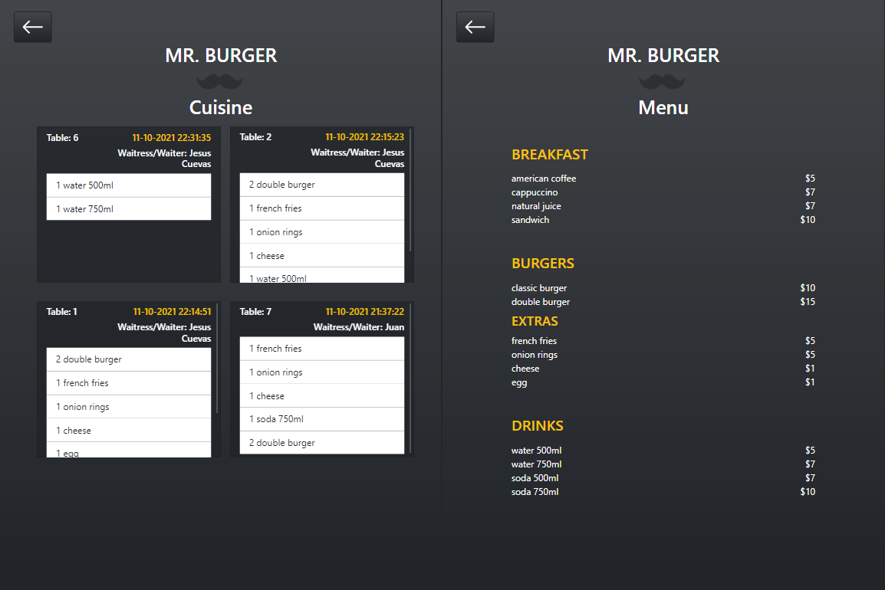

# MR. BURGER

## Índice

* [1. Preámbulo](#1-preámbulo)
* [2. Descripción general](#2-descripción-general)
* [3. Perfil de usuario](#3-perfil-de-usuario)
* [4. Historia de usuario](#4-historia-de-usuario)
* [5. Prototipo y diseño](#5-prototipo-y-diseño)
* [6. Interfaz](#6-interfaz)
* [7. Modo de usuario](#7-modo-de-usuario)
* [8. Tecnologías](#8-tecnologías)
* [9. Enlace web](#9-enlace-web)

***
## 1. Preámbulo

El sector de la gastronomía se ha modernizado muchísimo, donde cada vez existen más formas y tecnologías para gestionar las labores que se realizan o para dar visibilidad del propio negocio ante los potenciales clientes. 

Los Restauranes y Bares cada día adoptan las plataformas digitales como herramienta para agilizar el trabajo y comunicación de las diferentes áreas, buscando agilizar y optimizar la atención del cliente, disminuyendo el tiempo de espera al manejarse la información del pedido por aplicaciones que intercomunican al staff del servicio al cliente(meseros, administradores de caja, supervisores, jefes de área), con cocina. Todos estos teniendo acceso directo y simultáneo una vez ingresado el pedido; evitando mal información, ya que esta es fidedigna y comprobable al ingresarla, también se evita la perdida de la misma.

En definitiva,una plataforma digital ayuda a los restaurantes a automatizar el servicio y a mejorar la comunicación entre cliente y restaurante. 

Sin duda, contar hoy en día con una plataforma digital, dará al restaurant importantes ventajas frente a la competencia. Además, se administrará de manera más eficiente las comandas haciendo que el servicio sea mucho más rápido, algo que valorarán mucho los clientes.

## 2. Descripción general

Mr. Burger es una aplicación web diseñada para un negocio gastronómico especializado en venta de ricas hamburguesas.

Para potenciar su crecimiento, con la implementación de la aplicación se busca satisfacer la necesidad de optimizar la gestión del restaurant, con el objetivo de controlar todos los procesos de cada área, de manera centralizada y simplificada: comandas, registro de tiempo de pedido, cuentas de cada mesa. De modo de poder tomar y hacer los pedidos de manera oportuna, enviarlos a la cocina para que se preparen ordenada y eficientemente, y así poder identificar con facilidad alguna falla.
## 3. Perfil de usuario

Mr. Burger es un pequeño restaurante de hamburguesas, que está creciendo. Para optimizar este crecimiento y al responder a una necesidad de implementar una interfaz para tomar pedidos, se diseña una aplicación que se pueda usar en una _tablet_, pensado como dispositivo de fácil manejo y portabilidad en la labor diaria. Esta cadena ofrece un servicio de 24 horas, por lo que la aplicación facilitará la gestión de diversas personas, de una forma integral, satisfaciendo el óptimo manejo de la información recolectada por las diferentes áreas competentes, que tendrán acceso a ella en cualquier momento.
## 4. Historia de usuario
#### [Historia de usuario 1] Mesero/a debe poder tomar pedido de cliente

Yo como meserx quiero tomar el pedido de un cliente para no depender de mi mala
memoria, para saber cuánto cobrar, y enviarlo a la cocina para evitar errores y
que se puedan ir preparando en orden.

### Criterios de aceptación

Lo que debe ocurrir para que se satisfagan las necesidades del usuario)

* Anotar nombre de cliente.
* Agregar productos al pedido.
* Eliminar productos.
* Ver resumen y el total de la compra.
* Enviar pedido a cocina (guardar en alguna base de datos).
* Se ve y funciona bien en una _tablet_

### Definición de terminado

* Se puede enrolar el mesero o mesera a través de la asignación de un ID.
* Acceso a través de un ID asignado.
* Se puede crear mesas con el ingreso de nombre del cliente, número de mesas.
* Al crear una mesa está se idenfica con el nombre del mesero o mesera que la está atendiendo, número de mesa y nombre del cliente, también se especifica la fecha y hora en que se registra el pedido.
* Se puede escoger el menú, a través de tabs, que facilitán la visualización de las diferentes opciones. 
* Al seleccionar el pedido, de forma interactiva se visualiza la cantidad, los productos y el precio por la cantidad y el total del pedido.
* Se puede pagar de inmediato si el cliente lo solicita.
* El pedido se puede comandar a cocina.
* Cada pedido se puede visualizar en la sección de Tables, resumen que consta con nombre del cliente, número de mesa, nombre del mesero o mesera y productos pedidos con su respectiva cantidad y precio y el total. Con acceso a opción a pagar la cuenta.

## 5. Prototipo y diseño
- ## Diseño de alta fidelidad
### Tablet

[Ver Prototipo de alta fidelidad-Figma-](https://www.figma.com/proto/8oqUio4dirNDomAqXMITAW/natasha-gonzalez-s-team-library?node-id=315%3A2&scaling=scale-down&page-id=0%3A1&starting-point-node-id=315%3A2&show-proto-sidebar=1)

## Test de usabilidad
Se implementaron 2 tests de usabilidad, tomando en cuenta la experiencia de usuario y la intuitividad durante la navegación de la plataforma.

[Video Test de usabilidad 1](https://www.loom.com/share/2000b785934243dba5a2380a4bcb2b8e?sharedAppSource=personal_library)

[Video Test de usabilidad 2](https://www.loom.com/share/2ce4231907e948e69085df3ccb477f1d?sharedAppSource=personal_library)

Como resultado del feedback recibido, se iteró en el diseño e interactividad de la página, en donde se llevaron a cabo las sugerencias recibidas. Se realizaron ciertas mejoras, para así facilitar, optimizar la experiencia de usuario, cuyo principal objetivo es de simplificar el manejo y familiarización de la navegación para todo miembro del staff gastronómico.
## 6. Interfaz

## 7. Modo de usuario
Al ingresar a la aplicación se podrá enrolar(enroll) al mesero o mesara para asignarle un ID. También se tiene acceso al menú(menu), a los pedidos pagados(paid out) y la cocina(cuisine). A través de la introducción del ID personalizado a cada miembro del staff del servicio al cliente, tendrá acceso a un menú identificado por el nombre del mesero o mesara, identificando así su inicio de esión por su propia cuenta.

Este menú tiene 3 opciones:
- Tables: para acceder a los pedidos ya ordenados y comandados a cocina, los pedidos estarán ordenados por número de mesa. Donde se podrá visualizar el resumen del pedido y se podrá tener la opción del pago de la cuenta.
- New Table: se accede a un formulario para la introducción del nombre del cliente y el número de mesa. Una vez accedido, se podrá ingresar el pedido solicitado a través de la selección de diferentes opciones especificadas en la sección de Menu en la parte izquierda(Burgers -extras-, Breakfast, Drinks). 

  La seleción de cada pedido se reflejara de forma interactiva en la sección de Orders en la parte derecha, en donde se podrá visualizar la cantidad del producto, el producto en cuestión y el precio por cantidad, también el total de la cuenta. Cada producto se podrá eliminar de ser preciso o vaciar todos los pedidos solicitados de ser necesario. 

  En la parte inferior del pedido se podrá proceder al pago de la orden si así es solicitado por el cliente a la hora del pedido y también el comando para poder enviar el pedido a la cocina para su posterior preparación.
- Cuisine: donde se podrá visualizar los pedidos ordenado por tiempo al momento de ser emitidos. En los cuales se especificará: fecha y hora, número de mesa, nombre del mesero o mesera, cantidad y producto pedido.

## 8. Tecnologías

* React.js.
* JavaScript ES6.
* Firebase v9.
* Bootstrap 5.
## 9. Enlace web
